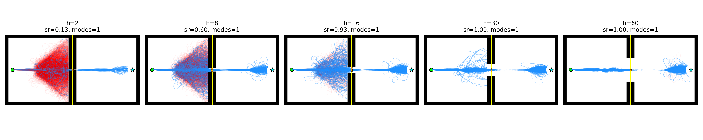
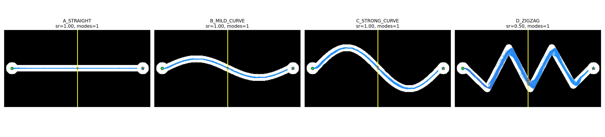
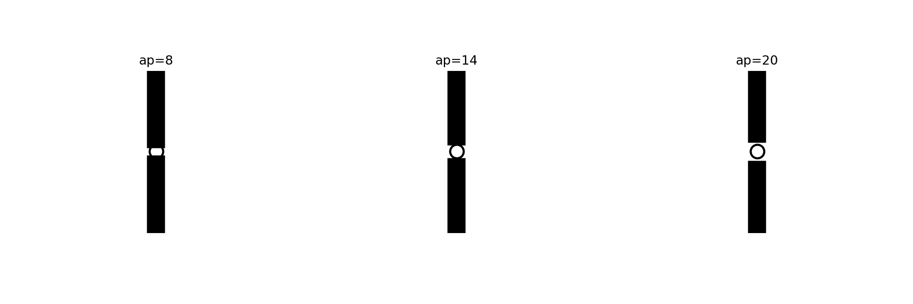

# STRUX_V1

Initial frozen public release of STRUX.

DOI:
https://doi.org/10.5281/zenodo.20113740

GitHub:
https://github.com/nathanbilitoponi-hub/STRUX_V1

---

# What is STRUX?

STRUX is an experimental geometric-transport framework for studying how constrained geometries affect propagation and structural organization.

Instead of asking only:

> "Does a path exist?"

STRUX investigates:

* how stable propagation remains,
* how directional coherence degrades,
* how bottlenecks affect transport,
* how constrained geometries alter collective propagation behavior.

The framework focuses on synthetic benchmark systems where geometry changes:

* synchronization,
* transport stability,
* directional coherence,
* propagation viability.

Current STRUX_V1 is intentionally lightweight and frozen for reproducibility.

---

# Core ideas

STRUX studies situations where two systems may have:

* the same connectivity,
* the same reachable target,
* similar path existence,

but very different dynamic transport behavior.

The framework currently focuses on:

* constrained propagation,
* geometric degradation,
* transport coherence,
* bottleneck sensitivity,
* multiscale structural organization.

---

# Included modules

## 1. Multiscale structural grouping

File:

core/multiscale/multiscale_life.py

Main function:

run_strux_life(...)

Features:

* radius clustering
* compactness estimation
* cut-ratio analysis
* multiscale promotion
* hierarchical compression

---

## 2. Filament connection scoring

File:

core/connection_scoring/connection_scoring.py

Main function:

score_region_connections(...)

Features:

* tube support estimation
* continuity analysis
* coverage scoring
* central density ratio
* strong/weak filament classification

---

## 3. Backbone extraction

File:

core/backbone/backbone_mst.py

Main function:

extract_backbone(...)

Features:

* sparse graph construction
* MST topology reduction
* minimal backbone extraction

---

## 4. Persistence estimation

File:

core/persistence/persistence.py

Main function:

compute_edge_persistence_advanced(...)

Features:

* bootstrap edge sampling
* DBSCAN persistence clustering
* persistent core extraction

---

## 5. Structural comparison

File:

core/compare/structure_compare.py

Main function:

run_brain_v2(...)

Features:

* node matching
* edge confirmation
* local agreement scoring
* structure comparison

---

## 6. Transport diagnosis

File:

core/transport/transport_diagnosis_v1.py

Main functions:

* diagnose_transport(...)
* count_gate_modes(...)
* classify_transport(...)

Features:

* constrained transport analysis
* directional coherence estimation
* gate-mode counting
* transport classification
* propagation diagnostics

---

# Current validated synthetic tests

The current release includes multiple synthetic benchmarks for constrained transport analysis.

## Aperture Threshold Test

Measures transport collapse under progressive geometric narrowing.

Output:

* success rate
* transport viability
* threshold detection

---

## Corridor Coherence Test

Measures directional degradation in:

* straight corridors
* curved corridors
* zigzag geometries

Output:

* directional coherence
* propagation degradation
* stability comparison

---

## Diamond Component Test

Studies local transport separation inside bifurcating geometries.

Output:

* local transport modes
* branching behavior
* bifurcation structure

---

## Clearance Test

Measures body-size vs aperture viability.

Output:

* pass/fail thresholds
* clearance ratios
* geometric transport constraints

---

# Install

Install dependencies:

```bash
pip install -r requirements.txt
```

---

# Run benchmark

Example benchmark:

```bash
python benchmarks/test_strux_v1.py
```

Transport benchmarks:

```bash
python -m benchmarks.transport_diagnosis_test_05

python -m benchmarks.corridor_coherence_test_01

python -m benchmarks.clearance_test_01

python -m benchmarks.diamond_component_test_01

python -m benchmarks.sieve_test_01
```

---

# Repository structure

```text
core/
    backbone/
    compare/
    connection_scoring/
    multiscale/
    persistence/
    transport/

benchmarks/
exports/
examples/
docs/
datasets/
```

---

# Current limitations

STRUX_V1 does NOT currently claim:

* new physics
* cosmology
* universal transport laws
* superiority over shortest-path algorithms
* full topological inference

Current focus is limited to:

* constrained geometric propagation
* transport degradation
* coherence loss
* synthetic benchmark diagnostics

---
# Current validated synthetic tests

## Example outputs

### Aperture Threshold Test



This benchmark measures transport collapse under progressive geometric narrowing.

---

### Corridor Coherence Test



This benchmark measures directional degradation in straight, curved, and zigzag corridors.

---

### Clearance Test



This benchmark measures body-size versus aperture viability and constrained transport clearance.

# Status

Experimental research framework.

This repository is a frozen V1 release and does not represent the final STRUX architecture.

---

# Author

Nathan Bili Toponi

2026
